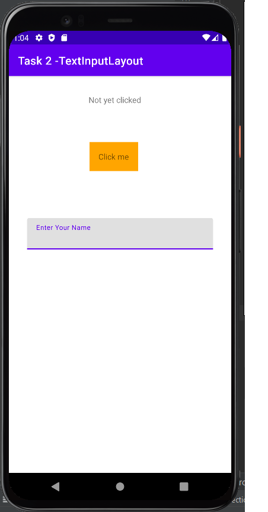
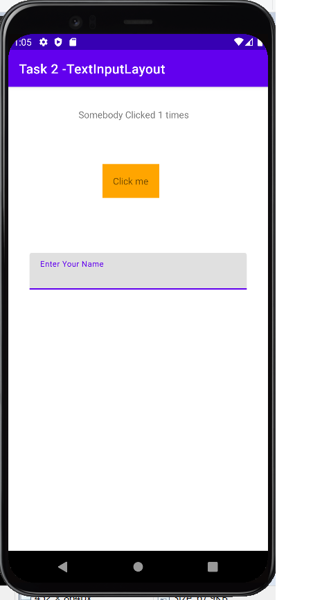
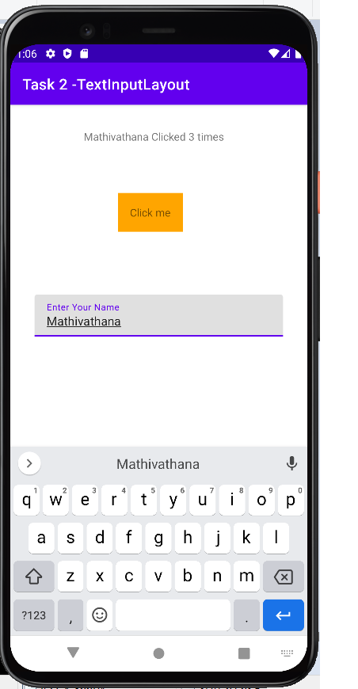
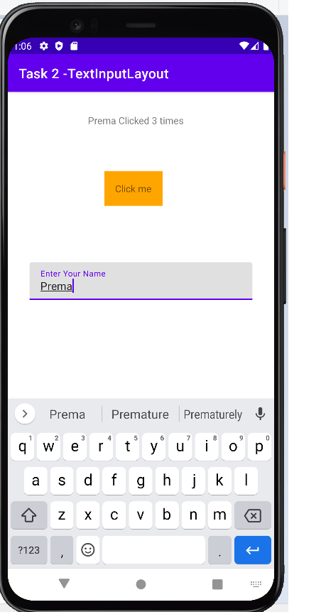
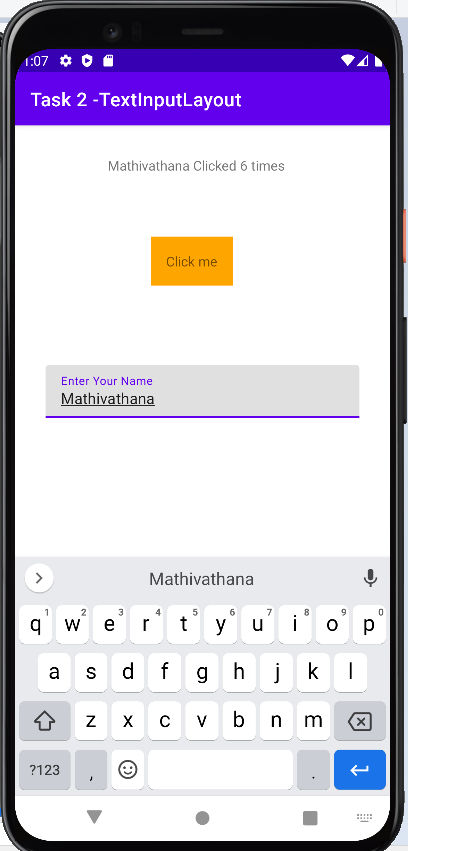

# Android-Studio---Task-2

In this application, there's only one counter for all users. Let's consider the following scenario
- user enters name Michael
- user clicks button 5 times -> user sees 'Michael clicked 5 times' message
- user enters name Nishanth
- user clicks button 3 times -> user sees 'Nishanth clicked 8 times' message

modify the application, so each new user would have their separate click counter. In the above scenario, it must be:
- user clicks button 3 times -> user sees 'Nishanth clicked 3 times' message  // 3 times, not 8 times in total

 
 
 
 
 
